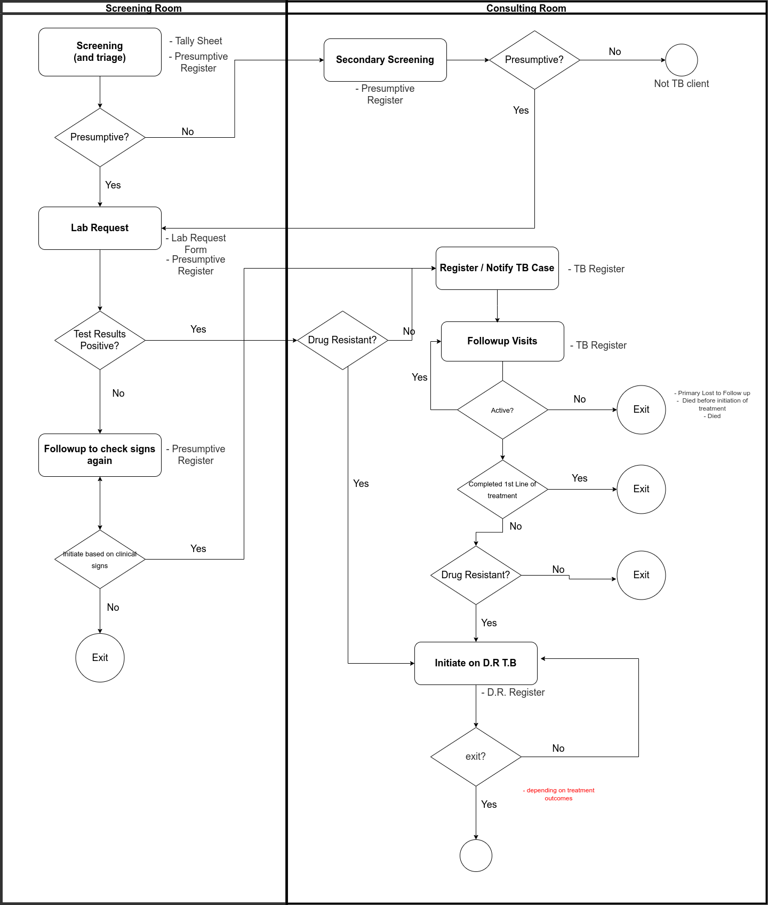

## [**TB Patient Flow**](https://drive.google.com/file/d/1b-NrAuPi7WNHNqDrUSnKzMnpSa9JrMsm/view?usp=sharing)

[**Fig 1 - TB Patient Flow**](https://drive.google.com/file/d/1b-NrAuPi7WNHNqDrUSnKzMnpSa9JrMsm/view?usp=sharing)

##### 1. DHIS2 Datasets to report to

|DHIS2 Dataset  | TB Notification 2020 | TB Treatment Outcomes 2020 | Presumptive TB Cases Report | D.R TB Report Surveillance 2020 | D.R TB TB (Hospital) |
| --- | --- | --- | --- | --- | --- |
| **Source Documents** | TB Register | TB Register | Tally Sheet, TB Presumptive Register |TB Register |TB Register |
| **Corresponding eRegister Tools** | TB Intake, TB Followup | TB Intake, TB Followup | TB Intake, TB Followup | TB Intake, TB Followup | TB Intake, TB Followup |

##### 2. eRegister Facility Level Patient Reports

!!! note
    * most of these reports are informed by PEPFAR MER Indicators and have been named to align with them
    * you can explore these reports here: [hiels.gov.ls/bahmni/reports/](https://hiels.gov.ls/bahmni/reports)

* **TB-001 | TB Outcomes (List)**	
* **TB-002 | TB Case Detection**	
* **TB-003 | Documented TB/HIV Activities**	
* **TB-004 | TB Testing Strategy**
* **TB-005 | TB Contact Tracing and Screening**	
* **TB-006 | All TB Patients on Treatment**	
* **TB-007 | New and Relapse Enrolled on TB**	
* **TB-008 | TB Status (List)**	
* **TB-009 | TB Status (Pivot)**	
* **TB-010 | New and Relapse Enrolled on TB (List)**	
* **TB-011 | DSD TB_ART (List)**	
* **TB-012 | DSD TB_ART (PIVOT)**	
* **TB-013 | TB Screening Among HIV Clients**	
* **TB-014 | TB Prevention Therapy (List)**	
* **TB-015 | TB Prevention Therapy (Pivot)**	
* **TB-016 | TB SCREENING**	
* **TB-017 | TB Intakes (List)**	
* **TB-018 | TB Intakes (Pivot)**	
* **TB-019 | TB Indicators (List)**	
* **TB-020 | Registered TB Visits with TB Consultation (List)**