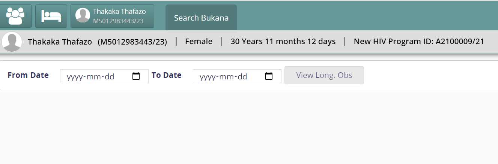
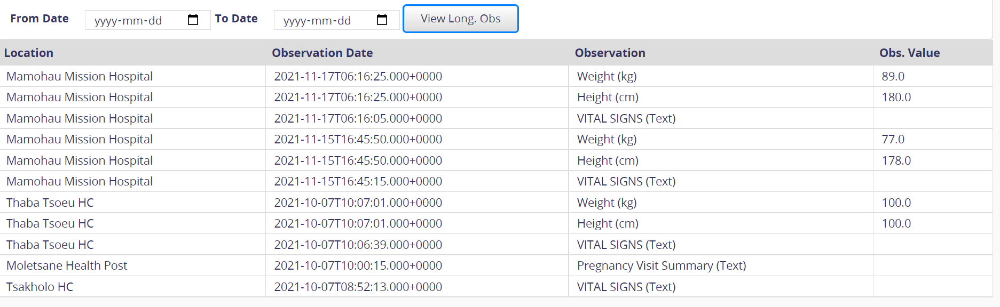

# Clinical Search Deployment Guideline

Repositories to pull updates from

    1. Bahmniaps_release
    2. Openmrs-module-bahmnicore-release
    3. Openmrs-module-xdssender-release
    4. Openmrs-module-dhisconnector-release
    5. Bahmni-docker

Updates deployment in eRegister

    1. Make sure all services are running for all the mentioned repositories.NB don’t git clone please
    2. Copy all downloaded omods files to /opt/openmrs/modules/
    3. For bahmni docker repo, after pulling from master branch, go to misc folder and restore global_property_15112021.sql
    4. Restart openmrs to load updated modules

Deployment verification

**Xdssender**

Search `xdssender.exportObsEndpoint` and verify the property  is set to `http://devbukanals.org/xdsrepositoryrest/openmrs/ws/rest/v1/obs`

*DHIS connector you should see the following snapshot*

**Bahmni apps** 

*You should see the following snapshot*

After clicking view Long. Obs button you should get the following reponse from SHR.

**DHIS connector**

Go to location mapping form , under OpenMRS location you should see long list of locations.Make configurations by testing the DHIS server, mapping the  right location in OpenMRS to DHIS2, configure the right mappings under automation form. Check that the reporting auto running scheduler is running.
