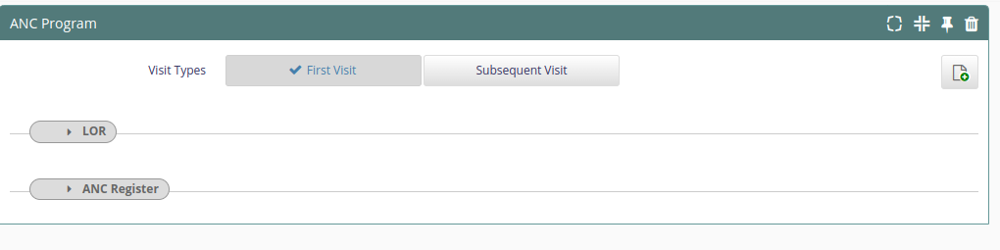
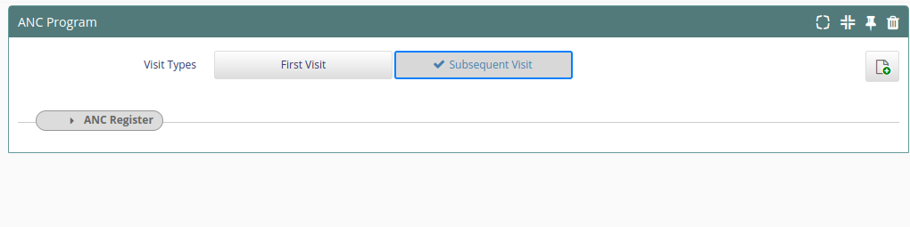

### eRegister Release Notes

!!! info
    * eRegister is based on => [0.92](https://bahmni.atlassian.net/wiki/spaces/BAH/pages/20185103/Release+Notes)

!!! warning
    * this beta version is going to be deployed at selected pilot facilities. 
    * Please report issues here: [https://github.com/eRegister/bahmni_docker/issues](https://github.com/eRegister/bahmni_docker/issues)

### **Release Notes January 2024**
#### Updates
- New TB forms
- HIV POC Viral Load Register concepts and form 
#### Reports
##### New Reports
- PMTCT ART
### **Release Notes December 2023**
#### UI Changes
- Remove CAG button in consultation
#### Reports
##### Openmrs
- Revisited childres regiment 1st, 2nd and 3rdline to include clients missed
##### Modifications
- Art-001 | Current on ART Detailed (List) -- Remove visitors from missed 
- Art-002 | Current on ART Detailed (pivot) -- Remove visitors from missed
- MCH-011 | Family Planning - List ( Removed N/A opetion when option is selected.)
- MCH-012 | Family Planning - Pivot ( Removed N/A opetion when option is selected.)
- LAB-003 | Lab Shipping List (Revise  report to only include date specimen collected and lab order number)
### **Release Notes November 2023**
#### Reports
##### New Reports
##### Modifications
- MCH-003 | AnteNatal Care (ANC) - List
- MCH-004 | AnteNatal Care (ANC) - Pivot
Remove EID as an identification for ART Clients
- ART-019 | Registered ART Clients with Intakes (List)
- ART-020 | Registered ART Clients with Intakes (Pivot)
- ART-021 | ART Client Without Intakes (List)

- Show Tuberculosis test section when Tuberculosis test type is clicked
- Show Viral Load test section when Viral Load test type is clicked

- remove emrapi.sqlSearch.cag error
- This error pops up when a user is on clinical APP index page.

- Lab shipping Report, Adding IPV to under 5, TB New and Relapse

- LAB-003 | Lab Shipping List - New report

- MCH-007| Child Health (Under5) - List - Added IPV to 3rd Dose and remove Rotavirus

- TB-010 | New and Relapse Enrolled on TB - Generated the pivot from the report same as TB-013 | New and Relapse Enrolled on TB (List)

- TB-013 | New and Relapse Enrolled on TB (List) - Select latest Status to avoid duplication
- openmrs_reporting_release
- 2020_ART_Current
- Remove visitors   
### **Release Notes October 2023**
#### Updates
- Update cervical_scrn_list.sql | There was duplication in the list where if a client has received both PNC and cervical screen services would appear twice in the cervical cancer screening list.
- Removal of the person id from the list and
Removal of duplication caused by EDD not being confined to the observation date. e.g a patient with multiple pregnancies and hence multiple EDDs is duplicated number EDD times on the lis
#### MDR-TB Updates
- Added TB status global variable | Changes were made to enable the MDR-TB section to show only when the "On DR TB Treatment" option is selected in the visit details page
#### Reports
##### New Reports
- Cervical Cancer Screening (Pivot)
##### Modifications
*** LAB-01 | Lab_Report (List) *** 
- Added the Results column in order to include 
- Added date results were received from Lab
- Added Lab order number
- PIR13: Registered ART Clients with Intakes Progress Report - pick clients with ART number or form and exclude visitors

*** Modified LDL results received for the following ***
- LAB-01 | Lab_Report (List)
- LAB-01 | Lab_Report (List)

#### Openmrs reports
- eRegister Monitoring Report - Cervical Cancer completeness had the wrong concept

#### New Mappings

- Children ARV Regimen 1st Line 4C Mapping
- Children ARV Regimen 1st Line 4D Mapping
- Children ARV Regimen 1st Line 4E Mapping
- Children ARV Regimen 1st Line 4F Mapping
- Children ARV Regimen 1st Line 4G Mapping
- Children ARV Regimen 1st Line 4H Mapping
- Children ARV Regimen 1st Line 4J Mapping
- Children ARV Regimen 1st Line 4K Mapping
- Children ARV Regimen 1st Line 4L Mapping

- Children ARV Regimen 2nd Line 5A Mapping
- Children ARV Regimen 2nd Line 5B Mapping
- Children ARV Regimen 2nd Line 5C Mapping
- Children ARV Regimen 2nd Line 5D Mapping
- Children ARV Regimen 2nd Line 5E Mapping
- Children ARV Regimen 2nd Line 5F Mapping
- Children ARV Regimen 2nd Line 5G Mapping
- Children ARV Regimen 2nd Line 5H Mapping

### Bahmni DOcker
- Adding Latest developments made to k8s cluster
- Adding Latest developments made to k8s cluster

### **Release Notes September 2023**
#### Updates
- Modified the query to remove duplication caused by one child having multiple vaccines on a dose
Update eMTCT_list.sql
- Added patient identifier column to the report to make it easy to distinctly identifier patients
- MDR-TB section shows only when the "On DR TB Treatment" option is selected in the visit details page
Added TB status global variable
- Changes were made to enable the MDR-TB section to show only when the "On DR TB Treatment" option is selected in the visit details page
#### Reports
##### Modifications
- ART-001 | Current on ART Detailed (List) - Exclude visitor if true on latest follow up form
- ART-002 | Current on ART Detailed (Pivot) - Exclude visitor if true on latest follow up form
- MCH-003 | AnteNatal Care (ANC) - List - The dates were hard coded
###### Openmrs Report: 
- weekly_and_monthly_reports | Serialized_Object : Includes new report called eRegister_Monitoring_Report
- Children ARV Regimen_1stLine_4C, 4D, 4E, 4F, 4G, 4H, 4J, 4K, 4L
- Children ARV Regimen_1stLine_Adherence, Viral Load
- Children ARV Regimen_2ndLine_5A, 5B, 5D,5E, 5F, 5G, 5H
- Children ARV Regimen_2ndLine_Adherence, Viral Load
- Children ARV Regimen_3rdLine_6A, 6B, 6C, 6D, 6E, 6F
- Children ARV Regimen_3rdLine_Adherence, Viral Load
### **Release Notes August 2023**
#### ANC
##### ANC Form fixes and modifications
- Blood pressure is moved to below EDD
- Covid 19 status has been added to the form
- High risk pregnancy options were changed to match the current ANC register
- Complications during pregnancy were changed to match current ANC register
- Parity and Gravida are now auto-filled from the previous form in the ANC form
#### MDR-TB in registration
##### Added MDR-TB-DEMOGRAPHICS and HOUSEHOLD CONTACT
##### Direction for MDR-TB section
#### Reports
##### New Reports
- TB-002 | TB Case Detection (Pivot)
- TB-027 | MDR TB Clients - A new MDR report
- MCH-023 | PMTCT FO (List) : New report
- MCH-024 | PMTCT FO (Pivot) : New report
- TB-028 | MDR TB Clients (Pivot) : New report
- Cervical Cancer Screening (List) : New report to include all clients screened
##### Modifications
- ART-019 | Registered ART Clients with Intakes (List) - Modified to exclude visitors
- ART-020 | Registered ART Clients with Intakes (Pivot) - Modified to exclude visitors
- ART-021 | ART Client Without Intakes (List) - Updated to exclude visitors
- TB-001 | TB Case Detection (List) : Modified to include all tb screened clients
- MCH-017 | PMTCT STAT (List) : Modified to pull all tested ANC first visits
- MCH-018 | PMTCT STAT (Pivot) : Modified to pull all tested ANC first visits
- MCH-003 | AnteNatal Care (ANC) - List : Modified to remove duplication of clients by restricting the report to only pick the latest MUAC
##### CAG
- Creating Cag Module Base Code : (This is the base code from which cag module development begins to take effect)
##### Other
- Renamed DISA parameter codes and added new LOINC code
- Remove HPV results error in cervical cancer screening form
- Reports.json : Added Cervical Cancer Screening (List)

### **Release Notes July 2023** 
#### TB
##### - Changes made in the TB intake and TB followup forms

- CD4 count, Date of CD4 count and HIV test done were added.
- Prevention of OIs was changed to appear below HIV management instead of above
- Added other to indication for starting PrEP
####
##### - Added VILI test to "Type of screening offered" field in the cervical cancer screening register

##### - Added lab test number to the following TB lab tests

- Genexpert
- Line Probe Assay (LPA)
- Culture and DST
- X-ray and other tests
- Added lab test number to the following TB lab tests

#### Pharmacy 
- Added DTG 10 mg, DTG 50mg, Isoniazid/Rifapentine (300/300mg) to pharmacy drugs

#### ANC Config
The following attributes are now auto filled from previous visits in the ANC Register

- Blood group
- Last Normal Menstrual Period
- Estimated Date of Delivery
- HIV status known before first visit
- The "From Lesotho" field only appears in the first visit
- The "TT Previous Doses" field only appears in the first ANC visit
- TB lab test no. was added to the following TB tests in the follow up form
- Phenotypic tests
- Culture and DST

#### Reports
##### New Reports
- ART-002A | TxCurr Quarterly Test (List)
- MCH-001 | HIV Exposed Infants (HEI) - List : Excluded Under 5 information
- MCH-002 MCH-002 | HIV Exposed Infants (HEI) - Pivot : Excluded Under 5 information
- MCH-035 | ANC Data Quality Assessment || (Added the following columns to ANC Data Quality Assessment, Iron, Folate, Calcium, MUAC, Rhesus Factor, TD previous Doses, TD current Doses)
##### Modifications

###### (Modified to align with ART-001/2 | Current on ART Detailed)
- ART-044 | TX_CURR (List)
- ART-043 | TX_CURR (Pivot)

- TB-002 | TB Notification (List)
- TB-003 | TB Outcomes (List)

###### Openmrs Report: 
- HTS Period Indicator Report | Exclude voided confirmatory results
- 2020_ART_Current | Remove visitors from ART current

#### Other
- Added concepts source DISA and LOINC 
- Added corresponding new refence terms 
- Created new viral load concepts and added mappings to the new and existing concepts.

### **Release Notes June 2023**
#### 
#### HIVTC visitor config
- Hides the "From(site)" if the client is not a visitor
#### ANC Autocalculate EDD
- The system can calculate EDD in alignment with the new ANC form
####  TB
- TB-HIV Activities: Multi-select on Prevention of OIs
- Initial phase now has outcomes, they are no longer greyed out
#### HTS Testing Eligibility
- Adding multiple selection in HTS on concept Testing Eligibility, Last 12 Months
#### ANC latest configs

- Allow future dates to be entered for subsequent visit EDD
- Remove viral load template warning message in ANC program
- LOR: Obstetric History
Parity, Alive and Miscarriages are hidden by 
default and appear again, when Gravida > 1
- LOR: History of Past Pregnancies
Hidden by default, and appears only when Gravida > 1
- LOR: Gynaecological History
Result of Pap smear: hidden by default and only appears when “Ever Had Pap 
smear” is “YES”
STI treated and Date STI Treated are hidden by default, but visible when 
“History of STI” is “YES”
Below Miscarriages: “When”, “Gestation Period” and “Curetage” are hidden by 
default, but visible when miscarriages is "YES"

- LOR: Surgical History
“Type of surgery” hidden by default and appears only when “Any Surgery” 
is selected “YES”
“Specify” hidden by default. Visible only when “Other” is clicked under 
“Type of Surgery”

- ANC Register: Investigations and Immunizations
Syphills Treatment Completed: Hidden by default, visible when “Reactive”
 is clicked

- ANC Register: HIV Testing Services
Initial Test During this Pregnancy: visible when HIV Status before 1st 
Visit is not positive, otherwise hidden
Initial Test During this Pregnancy: HIV Result: Visible only when HIV 
1Test Done? Is “YES”
Initial Test During this Pregnancy: HIV Result Received: visible only 
HIV Test Result are Positive or Negative, otherwise hidden
Subsequent HIV Test Results: hidden by default. Visible when Known HIV 
Status before 1st visit is not positive and initial test results during 
this pregnancy is not positive
Male Partner Involvement: HIV Status hidden by default, visible when 
“YES” is clicked

#### Reports
##### Modified
###### Art Reports Modified.
- ART-001 | Current on ART Detailed (List)  - To exclude visotrs
- ART-002 | Current on ART Detailed (Pivot)  - To exclude visotrs
- ART-001 | Current on ART Detailed (List) - Corrected to exclude dead patients from the initiated section of the report
- ART-002 | Current on ART Detailed (Pivot) - Aligned with the list version
- ART-017 | Registered ART Visits with ART Consultation (List) : Includes Art Clients who had other visits other than Drug pickup and viral load visit
- ART-018 | Registered ART Visits with ART Consultation (Pivot) : Includes Art Clients who had other visits other than Drug pickup and viral load visit
- ART-043 | TX_CURR (Pivot) - Corrected to exclude dead patients from the initiated section of the report
- ART-044 | TX_CURR (List) - Aligned with the list version
- ART-061 | Pre-ART - Revise the report to pull clients retested positive and not linked to care
- ART-067 | PEADS Aging Out Analysis (Client Outcomes) - Updated to track  Q4 Sept 2022 txcurr
- ART-068 | PEADS Aging Out Analysis (Client Appointments) - Updated to track  Q4 Sept 2022 txcurr
###### HTS Reports Modified.
- HTS-006 | Self Test Clients(List) : modified to allow the report accomodate all periods
- HTS-007 | Self Test Clients(Pivot) : A new report reports.json : addition of a new report
- Reports.json : addition of a new report
###### MCH Reports Modified.
- MCH-003 | AnteNatal Care (ANC) (List)   - This report has been optimized
- MCH-004 | AnteNatal Care (ANC) (Pivot)  - Corrected number of first ANC Visits to be equal to total trimester
- MCH-011 | Family Planning - List
- MCH-012 | Family Planning - Pivot
- MCH-029 | Registered FP Visits with FP Consultation (List)
###### TB Reports Modified.
- TB-001 | TB Case Detection (List) : Included "Referred by(CBO/CHW)" and "Died before treatment" indicators
- TB-002 | TB Notification (List) : Included "Prophylaxis provided" indicator
- TB-003 | TB Outcomes (List) : Added two treatment outcomes: Not Evaluated and Moved to Second line
- TB-017 | TB Prevention Therapy (Pivot) : Revised TPT pivot report
- TB-019 | TB Intakes (List) - Corrected to include intakes captured within a year of the report start date only
- TB-020 | TB Intakes (Pivot)- Aligned with the list version

### **Release Notes May 2023**

#### Clinical Module
 

----------------------------------------------------------- **Tuberculosis - Intake** -----------------------------------------------------------

###### The following were added:
  - Linkage: Added country and facility: for out of the country Transfer In
  - History of previous treatment: Added "Other" Option and "Specify"
  - Social Behaviour Section
  - Laboratory Tests: Added Culture and DST, added Test Lab no and date test was done on each Test type
  - Medical History and Other Comorbidites
  - Intensive care

----------------------------------------------------------- **Tuberculosis - Followup** -----------------------------------------------------------
###### The following were added:
 - Laboratory Tests:
    - Added Culture and DST
	- Added Test Lab no. to Phenotypic tests
	- Added date test was done on each Test type

 - Contact Tracing
 - The option to allow users to multiple contact info for traced TB contacts

 ----------------------------------------------------------------------- **Under5** -----------------------------------------------------------------------
 
 - Added feature to auto fill Under5 and ANC Number from first Under5 register consultation in subsequent visits

#### Reports
##### Modified

 - ART-003 | Missed Appointments Status Report (List)	Modified to only consider transfers out in the latest follow up form
 - ART-045 | TX_CURR MMD (List) MMD missed removed
 - ART-046 | TX_CURR MMD (Pivot) MMD missed removed
 - TB-020 | TB Intakes (Pivot)- Aligned with the list version
 - TB-019 | TB Intakes (List) - Corrected to include intakes captured within a year of the report start date only
 - ART-001 | Current on ART Detailed (List) - Corrected to exclude dead patients from the initiated section of the report
 - ART-002 | Current on ART Detailed (Pivot) - Aligned with the list version
 - ART-043 | TX_CURR (Pivot) - Aligned with the list version
 - ART-044 | TX_CURR (List) - Corrected to exclude dead patients from the initiated section of the report

##### Newly added
 - ART-080 | Visitors Report (List)
 - ART-081 | Visitors Report (Pivot) 

### **Release Notes April 2023**

#### Clinical Module

---------------------------------------------------- **HIV Treatment and Care - Follow Up** -------------------------------------------

- HIV Treatment and Care module
    - new "visitor" field to easily identify visiting clients

---------------------------------------------------- **[ANC Register](https://docs.google.com/document/d/1WLKphDTfFoqSMjhsRg9r1hUQGu2AIOG1/edit?usp=sharing&ouid=108376078359942224064&rtpof=true&sd=true)** ----------------------------------------------------

- ANC Program revised to mimic the newly released ANC Register
    - Revised the whole ANC Register
        - Calcium
        - Nutritional Assesment
        - Sign of GBV
        - Covid19
        - Rhesus Factor
        - Tetanus Diththeria (TD) Doses
    - Added new broader section "HIV Testing Servies"
    - Clinical WHO Staging
    - Referrals

------------------------------------------------------------------------- **HIV Testing and Counseling** ----------------------------------------------------------------

- The 'kit collected for' field is now compulsory when secondary distribution mode is selected

--------------------------------------------------------------------------- **Family Planning Register** ------------------------------------------------------------------

- Follow up date added
- Multiselect on family counselling services provided enabled
- Entering future dates on IUCD/Implant check-up date enabled

#### Reports
##### Modified
- TB-026 | TB Data Quality Assessment Tool - modified to:
 - Include TB regimen
 - Treatment outcome regardless of the report
 - Type of test performed
 

- ART-077 | Weekly PPR (List) : corrected to show weekly defaulters and NCLIs that came after 91 days

- ART-078 | Weekly PPR (Pivot): corrected to show weekly defaulters and NCLIs that came after 91 days

- MCH-007 | Child Health (Under5) - List - Added all the multi selected immunization

- ART-022 | Data Quality Assessment Tool - Viral load column to provide explicit values for VL >20

- HTS Final Status Report - solved duplication caused by editing the form.

- TB-022 | Registered TB Visits with TB Consultation (List) - Modified to be more accurate

- TB-023 | Registered TB Visits with TB Consultation (Pivot) - Modified to be more accurate

- HTS-002 | HTS Final HIV Status PITC (Pivot) : Revised to exclude clients with Tested in ANC Form

- HTS-004 | HTS Final HIV Status CITC (Pivot) : Revised to exclude clients with Tested in ANC Form

- TB-026 | TB Data Quality Assessment Tool - Select client initiated during period and date transferred in for SA clients
 
- Revised Rapid HTS reports to eliminate duplication of Clients who had ANC Form consultaions (OpenMRS reports)

##### Newly added
- Tb_Notification reports( Block 1,Block 2,Block 3,Block 4) (OpenMRS reports)
- TB Outcome reports (Block 1 and Block 2) (OpenMRS reports)

- MCH-001 | HIV Exposed Infants (HEI) - List
- MCH-002 | HIV Exposed Infants (HEI) - Pivot
- MCH-003 | AnteNatal Care (ANC) - List
- MCH-004 | AnteNatal Care (ANC) - Pivot
- MCH-005 | Post Natal Care (PNC) - List
- MCH-006 | Post Natal Care (PNC) - Pivot
- MCH-007 | Child Health (Under5) - List
- MCH-009 | Labour and Delivery - List
- MCH-010 | Labour and Delivery - Pivot
- MCH-011 | Family Planning - List
- MCH-012 | Family Planning - Pivot
- MCH-013 | Nutrition - List
- MCH-014 | Nutrition - Pivot
- MCH-015 | PMTCT STAT DINOMINATOR (List)
- MCH-016 | PMTCT STAT DINOMINATOR (Pivot)
- MCH-017 | PMTCT STAT (List)
- MCH-018 | PMTCT STAT (Pivot)
- MCH-019 | PMTCT EID (List)
- MCH-020 | PMTCT EID (PIVOT)
- MCH-022 | PMTCT HEI POS (Pivot)
* -

--------------------------------------------------------------------------------------------------------

### **Release Notes March 2023**
#### Reports
##### Modified

- ART-022 | Data Quality Assessment Tool - Viral load column to provide explicit values for VL >20
- TB-018 | TB Intakes (List) - Changed the variable #enddate# to #endDate#
- MCH-014 | PNC SEEN (List) - Added First_PNC_Attendance, Place_of_Delivery, FP_Counselling, FP_Method, Syphilis_Screening, Cancer_Screening, Cancer_Assessment_Method,HIV_Testing_Result, Breastfeeding, MUAC_less_than_23cm
- MCH-017 | Child Health Attendance - Under5 (List) - Added Months, Base_Dose, 1st_Dose, 2nd_Dose, 3rd_Dose, Fully_Immunized, Measles_1st_Dose, Measles_2nd_Dose, Dt_1st_Dose
- HTS-001 | HTS Final HIV Status (List) - solved duplication caused by editing the form.
- ART-003 | Missed Appointments Status Report (List) - location re-added
- ART-003 | Missed Appointments Status Report (List) - Order clients by their appointment status, appointment date

#### Clinical Module

- Self test distribution mode is now compulsory  
- Added version date on bahmni login page  

------------------------------------------------------------------------------------------------------------

### **Release Notes February 2023**

#### Reports

- TB-025 | TB Data Quality Assessment Tool - Added prevention of IOs with the new concept
- TB-026 | TB Outcome (List) - new report. The previous report was not a list but a pivot.
- TB-001 | TB Outcomes (Pivot) - has been renamed to pivot not list
- ART-031 | TX_NEW (List) : include died in the same period
- ART-032 | TX_NEW (PIVOT) : include died in the same period
- ART-078 | PrEP NEW (List) - new report

#### Clinical Module

- HIV Management Made Multi-Select On TB intake Form
- Labour and Delivery register: allow add more and conditions
- Txnew pivot modification and add prep new tb outcomes list to json file
- Adding the Cancer Screening Report to the reports.json file
- Fixed Prep Follow Up Form concept spelling
- Swapped OIs and HIV Management on the TB Intake form

--------------------------------------------------------------------------------------------------------

### **Release Notes January 2023**

#### Reports
- Added TB-025 | TB Data Quality Assessment Tool to reports json file
- MCH-014 | PNC SEEN (List) - New Report 
- MCH-015 | FP SEEN ( List) - New Report 
- MCH-016 | Under5 SEEN (List) - New Report
- MCH-017 | HIV Exposed Infant SEEN (List) - New Report
- Added the following patientAttributes :
	- Occupation
	- Marital Status
	- Extra Address Information
	- Treatment Supporter/Next of Kin
- Added File Number as one of the extraPatientIdentifiers
- TB-025 | TB Data Quality Assessment Tool - Correcting wrong concept_id used for TB treatment outcomes
-  TB-025 | TB Data Quality Assessment Tool
    - Remove the last column (labelled HIV)
    - Include History of Previous Treatment, just after Site
    - On the Clients_on_ART column, the tool should pull results as New on ART or Already on ART not active.
    - For Site, results should be Pulmonary (with correct diagnosis) or Extra Pulmonary

- ART-001 | Current on ART Detailed (List)
- ART-002 | Current on ART Detailed (Pivot)
- ART-043 | TX_CURR (List)
- ART-042 | TX_CURR (Pivot)

#### Clinical Module
- Correct transferred out clients were picked under missed.

--------------------------------------------------------------------------------------------------------

### **Release Notes December 2022**

* ##### Reports
    * ###### Bahmni 
          - *TB-025 | TB Data Quality Assessment Tool* - new report 
          - *PHARM-004 | Registered Clients Prescribed and Dispensed (List)* - New report
          - *PHARM-005 | Registered Clients Prescribed and Dispensed (Pivot)* - New report
          - *PHARM-001 | Pharmacy ARV Regimen* - Displays details and status of Regimens
    * ###### Openmrs
          - A new serialized object for the fix of pitc and citc reports in openmrs (They were not picking some clients and were duplicating others)

--------------------------------------------------------------------------------------------------------

### **Release Notes November 2022**

* ##### Reports
    * ###### Bahmni 
          - *ART-001 | Current on ART Detailed (List)* - Newly added ECID Identifier results in Zeros under MMD - Solved
          - *ART-001 | Current on ART Detailed (List)* - Clients who transferred out and came back under clients_missed_28days
          - *MCH-005 | Ante Natal Care (ANC) (List)* - Added Iron, Folate, Blood_Group
          - *TB-018 | TB Intakes (List)* - Corrected the report to pull patients correctly
          - *HTS-001 | HTS Final HIV Status (List)* - Eliminated some duplicates for clients who came more than twice a month
          - *HTS-002 | HTS Final HIV Status PITC (Pivot)* - Eliminated some duplicates for clients who came more than twice a month
          - *TB-007 | New and Relapse Enrolled on TB* - Exclude clients that are not new or relapse
          - *HTS-001 | HTS Final HIV Status (List)* - Added service points, and also considers start & endDates
          - *HTS-009 | HTS Data Quality Assessment Tool* - Considers start and end dates
          - *PHARM-003 | Dispensing Summary Report* -Provide labeling of medicines dispensed
          - *ART-036 | CXCA_SCRN (List)* - Added a New Report for Cervical Cancer Screening
          - *MCH-004 | Ante Natal Care (ANC) (Pivot)* - Added Muac and Suspected with TB Column
          - *PHARM-002 | Dispensing Orders report* - Clients dispensed, Age, Sex, Regimen, Quantity Dispensed, Batch
          - *PHARM-001 | Pharmacy ARV Regimen* - Displays details and status of Regimens
          - *PHARM-004 | Registered Clients Prescribed and Dispensed (List)* - New report
          - *PHARM-005 | Registered Clients Prescribed and Dispensed (Pivot)* - New report

--------------------------------------------------------------------------------------------------------

### **Release Notes October 2022**
* ##### Reports
    * ###### Bahmni 
          - *ART-026 | Ante Natal Care (ANC)* - The report now relies on the start and end dates picked by the user, instead it picked the month and year of the end Date
          - *ART-026 | Ante Natal Care (ANC)* - The gap between 2nd and 3rd trimester (25 weeks) is now included
          - *ART-026 | Ante Natal Care (ANC)* - Total ANC follow up visits 2nd, 3rd and 4th now picks subsequent visits
          - Added a category for MCH Reports
          - *TB-024 | TB Case Detection (list)* - Adjusted the report number from 23 to 24 because the report above is also 23
          - *MCH-005 | Ante Natal Care (ANC) (List)* - New Report
          - *TB-014 | TB Prevention Therapy (List)* - consider start and end dates not month(), year()
          - *TB-015 | TB Prevention Therapy (Pivot)* - consider start and end dates not month(), year()
          - *MCH-005 | Ante Natal Care (ANC) (List)* - Corrected the Syphilis_Screening_Results column to distinguish Reactive and Non Reactive results
          - *MCH-005 | Ante Natal Care (ANC) (List)* - Added Haemoglobin, HIV_Status_Known_Before_Visit, Final_HIV_Status, Subsequent_HIV_Test_Results, MUAC, Tuberculosis
          - *ART-087 | Weekly PPR (List)* - Shows missed clients,NLICs, defaulters and initiations within a specific week
          - *ART-088 | Weekly PPR (Pivot)* - Shows missed clients,NLICs, defaulters and initiations within a specific week
          - *ART-019 | Registered ART Clients with Intakes (List)* - picks ART clients, using either the follow-up form or the ART Number
          - *ART-020 | Registered ART Clients with Intakes (Pivot)* - picks ART clients, using either the follow-up form or the ART Number
          - *ART-021 | ART Client Without Intakes (List)* - Identifies all clients who have art follow up but no intakes, regardless of whether they have art number or not
          - *ART-021 | ART Client Without Intakes (List)* - Identifies all clients who have ART number but no intakes, regardless of whether they have ART follow-up form or not.
          - *ART-021 | ART Client Without Intakes (List)* - Addition of the column status; aimed at classifying as to whether the clients is 'active', 'missed', 'defaulted', 'LTFU' or does not have ART follow up form
          - *ART-021 | ART Client Without Intakes (List)* - Arranged the report in order of their status, starting with the active clients and ending with those without ART follow up form

--------------------------------------------------------------------------------------------------------

### **Release Notes September 2022**

* ##### Reports
    * ###### Bahmni 
          - *TB_Intake report(list)* - correction to pull correction patients
          - *ART-001 | Current on ART Detailed (List)* - the report to report clients seen and missed by the end of the reporting period as missed
          - *ART-002 | Current on ART Detailed (Pivot)* - the report to report clients seen and missed by the end of the reporting period as missed
          - *ART-053 | TX_CURR (Pivot)* - the report to report clients seen and missed by the end of the reporting period as missed
          - *ART-054 | TX_CURR (List)* - the report to report clients seen and missed by the end of the reporting period as missed
          - *ART-077 | PEADS Aging Out Analysis (Client Outcomes)* - changed to track the latest cohort which is Q2 2021
          - *ART-078 | PEADS Aging Out Analysis (Client Appointments)* - changed to track the latest cohort which is Q2 2021
          - *ART-059 | TX_RTT (List)* - Disaggregations changed from IIT> 3months to IIT3-5months and IIT6+months
          - *ART-060 | TX_RTT (Pivot)* - Disaggregations changed from IIT> 3months to IIT3-5months and IIT6+months
          - *ART-061 | TX_ML (List)* - Disaggregations changed from IIT> 3months to IIT3-5months and IIT6+months
          - *ART-062 | TX_ML (Pivot)* - Disaggregations changed from IIT> 3months to IIT3-5months and IIT6+months
          - *PIR-17 Tx_CURR TXML* - Modified to use new disaggregation IIT3-5months, IIT6+months instead of IIT>3months
          - *PIR-17 Tx_CURR Retention Report* - Modified to use new disaggregation IIT3-5months, IIT6+months instead of IIT>3months
          - *TB-010 | New and Relapse Enrolled on TB (List)* - Added TB history, Key populations, HIV Status, Active and Defaulted Clients
          - *TB-011 | DSD TB_ART* - Added TB history, Key populations, HIV Status, Active and Defaulted Clients
          - *ART-003 | Missed Appointments Status Report (List)* - Arranged clients with appointment missed
          - *TB-022 | TB Drug Resistant (list)* - New Report
          - *TB-003 | TB Notification (List)* - New Report 
    * ###### Openmrs
          - *PIR-17 Tx_CURR Retention Report Mapping 2022* - Maps part of PIR-17 Tx_CURR Retention Report to Txcurr Retention and Attrition Report in DHIS2(TxRTT Section)
          - *PIR-17 Tx_CURR TXML_2022* - Maps PIR-17 Tx_CURR TXML Report to Txcurr Retention and Attrition Report in DHIS2(TxML Section)
          - *2020_ADULT ARV REGIMEN Mapping* - now maps to Adult Regimen 1f (a)TDF 3TC /EFV (400mg) other months which was previously blank

* ##### Clinical Module
    * New Prep Follow-Up Form
    * New Prep Intake Form
    * Made Under 5 Base Doses Multi-select
    * Added a Reports name filter in Bahmni-Reports 
    * Added 'Weeks of current gestation by LMP method' to Obstetric History on ANC Program Form.
    * Auto Calculate Gestational Age from LNMP on The ANC Program Form
    * Visits for other services e.g., FP, Cervical Cancer Screening, Enhanced Adherence Counseling and Under5
___
!!! info
**Do the following to deploy the new visits on your server:**

- Pull or Clone the new bahmni_docker
- Restore the following files in to the database (emr):

       `/bahmni_docker/misc/vist_types.sql`

       `/bahmni_docker/misc/new_vists_global_properties.sql`

- Pull the new bahmni_configs
- Rebuild the search index

--------------------------------------------------------------------------------------------------------

### **Release Notes August 2022**

* ##### Reports
    * ###### Bahmni 
          - *ART-022 | Data Quality Assessment tool* - was displaying a blank page
          - *ART-021 | ART Client Without Intakes (List)* - Added more columns(ArtNumber,age,gender,location)
          - *HTS-006 | Self Test Clients(List)* - Allow patient tested more than once in a month to appear more than once.
          - *TB-020  and  TB-021* - TB registration vs TB Consultation naming corrections
          - TxCurr report - include clients who do not have patient identifiers and use ECID identifiers in the report
          - Missed_defaulted_ltfu report - include service point in the report

* ##### Clinical Module
    * WHO staging made to disappear when T-staging is selected
    * Hid HIVST Results for primary when Secondary is Selected
    * SD Bioline is not available in most health centres at the moment so it should not be compulsory for indeterminate results

--------------------------------------------------------------------------------------------------------

### **Release Notes July 2022**

* ##### Reports
    * ###### Bahmni 
          - Reporting age groups have been modified to include the new age groups being 50-54, 55-59,60-64,65+.
          - *ART-022 | Data Quality Assessment tool* -  DQA Report had a bug after modification to include defaulted and lost to follow-up clients [Bug Fixed].
          - *ART-001 | Current on ART Detailed (List)* - Modified to include clients who do not have patient identifiers and use ECID identifiers in the report.
          - *ART-003 | Missed Appointments Status Report (List)* -  Added service point column in the report
    * ###### Openmrs 
          + *Created new children regimen reports that categorize children by weight:*
               - Children ARV Regimen_1stLine_2022
               - Children ARV Regimen_2ndLine_2022
               - Children ARV Regimen_3rdLine_2022
          + *2020_TB_Screening* - TB Screening previous report did not include all clients seen during period
          + *2020_TB_Screening* - Only clients that were seen physically at the facility. PreART clients. Clients that were physically seen and screened
* ##### Registration Module
    * Patient name now appears above maiden name in The Registration Module
* ##### Clinical Module
    * Fixed EDD Auto-Calculation
    * Hid PITC Results on CACX Form if The test has not been offered
    * The LPA susceptibility result is no longer compulsory because the result is not always available
    * Allow future Dates for Cervical Cancer Screening Follow up Date
    * Place of Delivery is Not Mandatory on ANC Form (While it remains Mandatory on the PNC Form)
* ##### Appointments Module
    * Fixed Column Headings of The Appointment Module List View
  
##- Release Candidate (RC) #1

* ##### Pharmacy Module
    * Customized core odoo addons and Bamni addons to fit Lesotho context
    * Changed workflow to suite Lesotho context
* ##### Reports
    * Ported all Bahmni 0.90 reports to Bahmni 0.92
    * Developed Informed Push Tool reports
* ##### Automated Deployment
    * Now supports auto deploying Bahmnni modules (apps), and odoo modules
* ##### Registration Module
    * National Search ported from 0.90 and improved
    * Rename gender to sex
    * Disabled camera and picture icon
    * Other Information: change contact to phone number
    * Hide PNC & ANC numbers for male patients
* ##### Clinical Module
    * Refactoring Bahmni App to align with 0.90
    * Improving the flow of order automation from observation to medication tab
    * Numbering on patient queue
    * Pregnancy status: use gender attribute to show and hide
    * Include both age and sex to the patient payload sent from bahmni to odoo
* ##### Atomfeed
    * Atom feed to allow concepts in Bahmni to automatically be pulled in odoo