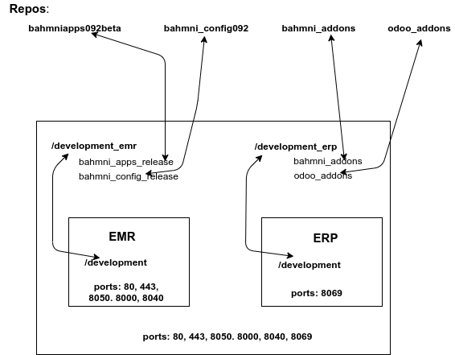
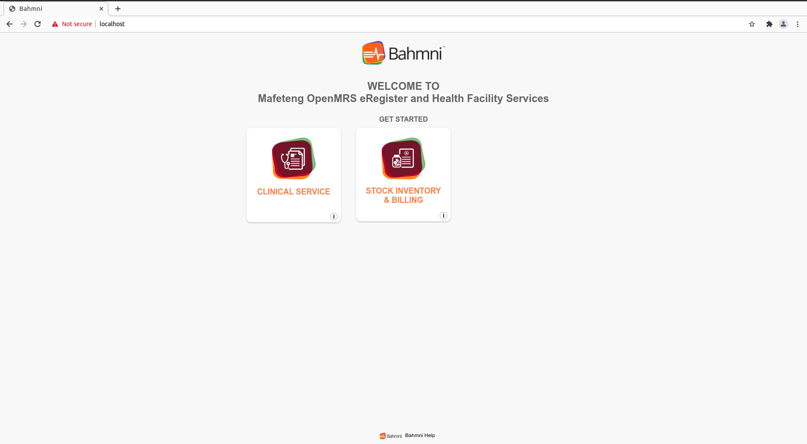

# Upgrading to Bahmni eRegister 0.92

#### **Preparing Bahmni 0.90 Backup**

----------------------------------------------------------------------------------

* First we have to take a proper backup of the system so that should the upgrade process be problematic, we have can resume facility activities with ease. 
We can start by taking a backup of the database with `docker exec -it openmrseregister mysqldump -uroot -p openmrs > openmrs.sql`. This command will create the backup inside the container but put the sql file outside the container.
* Then we can commit the running container to take a snapshot of it as is with `docker commit openmrseregister omrsregrepo/bahmni_092:18052021` _you can use whatever date when doing this for your tag_ 
* Before moving forward with the steps below, please make sure you have both the sql file and the docker image with `ls -lh`. The file openmrs.sql should be more than 100M, if in doubt, you can do `cat openmrs.sql` to see the file has content. Also do `docker images` and make sure you can see the image you just created.
* To prevent conflicting ports, we have to finally stop and kill the container with `docker stop openmrseregister` and remove it completely with `docker rm openmrseregister`

!!! warning
    * Please don't skip this step. It's very important to do the backup before upgrading!!!
----------------------------------------------------------------------------------

#### Installing Docker

The hosting should already have docker installed, but if for some reason it's not installed, please refer to this [guide](intro.md)

_Please go as far as installing docker only and then come back to this guide._

#### Installing Docker Compose

To upgrade to version 0.92, we're going to use Docker Compose we're using more than one container. To install Docker Compose, copy and run the following:

```
sudo curl -L "https://github.com/docker/compose/releases/download/1.29.2/docker-compose-$(uname -s)-$(uname -m)" -o /usr/local/bin/docker-compose
```

Then make the binary file you just downloaded executable with the command below (copy and paste)

```
sudo chmod +x /usr/local/bin/docker-compose
```
Check that everything is running well by running `docker-compose version` and you'll see something like this: 
```
docker-compose version 1.28.2, build 67630359
docker-py version: 4.4.1
CPython version: 3.7.9
OpenSSL version: OpenSSL 1.1.0l  10 Sep 2019
```
If you don't see anything, you might want to do `su $USER` to reload enviroment variables then do `docker-compose version` again.

#### Installing Git

Do `git version` to check if Git is already installed. If it's not, run `sudo apt install git`

#### Setting up containers



<sub>Fig 1 - eRegister Bahmni 0.92 Diagram</sub>

###### Preparing containers ######

* Go to home directory with `cd ~`
* Download the repo with docker-compose file: `git clone  https://github.com/eRegister/bahmni_docker.git`
* Change directory into **docker_docker** folder with `cd docker_docker`
* Start the containers with `docker-compose up -d`
    * _make sure you have internet connectivity because docker-compose is going to try do download the images to your serve_
* After running the command abover, While still in **$HOME/docker_docker**, run `docker-compose ps` to check if the containers without any errors. You should see something like:
```
           Name                          Command               State                                                              Ports                                                           
--------------------------------------------------------------------------------------------------------------------------------------------------------------------------------------------------
bahmni_docker_emr-service_1   /usr/sbin/init /usr/sbin/i ...   Up      0.0.0.0:33062->3306/tcp, 0.0.0.0:443->443/tcp, 0.0.0.0:80->80/tcp, 0.0.0.0:8000->8000/tcp, 0.0.0.0:8050->8050/tcp, 8053/tcp
bahmni_docker_erp-service_1   /usr/sbin/init /usr/sbin/i ...   Up      0.0.0.0:8069->8069/tcp 
```
* The above output is also important as it shows names of the two containers created. Now we need to restore out backup into the new instance we just created by:
    * copying `openmrs.sql` into the `bahmni_docker_emr-service_1` with `docker cp $HOME/openmrs.sql bahmni_docker_emr-service_1:/`
    * get into the `bahmni_docker_emr-service_1` container with `docker exec -it bahmni_docker_emr-service_1 bash`
    * run `ls` and you should see `openmrs.sql`
    * get into the MySQL database with `mysql -u root -p` then enter password
    * run `show databases` and you should see a list all databases which include a database called `openmrs`.
    * delete the `openmrs` database with `drop database openmrs`
    * recreate the database again with `create database openmrs`
    * get into the database with `use openmrs`. Before running the command below, make sure you're in the (blank) openmrs database by running `select database()` and you will see a small table that confirms that indeed you're in the openmrs database.
    * restore the backup with `source openmrs.sql`
* Then run `bahmni -ilocal start` to start services and daemons that Bahmni depend on.
* Go to `/var/www/` and run: 
    * sudo `rm bahmniapps` or `unlink bahmniapps`
    * do `sudo ln –s /development/bahmni_apps_release/ bahmniapps`
    * do `sudo ln –s /development/bahmni_config092/ bahmni_config_`
Browse to http://IP_of_eRegister/bahmni/home and check if the changes have been effected.
* Check that the system is running by browsing to http://SERVER_IP and you should see the new Bhamni 092 system as shown below:
* 


<sub>Fig 2 - eRegister Bahmni 0.92 After Upgrade</sub>

----------------------------------------------------------------------------------

##### **Configuring Automated Deployment** #####


###### 0. PREPARATORY STEPS ######
* SSH into the server with ssh `openmrs@_SERVER_IP_ADDRESS`
First check to see if your server has internet connectivity with ping github.com
Then download all of the files need with `git clone https://github.com/eRegister/docs.git`
The command above will create a folder called docs in /home/openmrs if you didn't change to another directory. All of files that need to be transferred to the server are in docs/scripts/:
    * `gitpull_bahmniapps.service`
    * `gitpull_bahmniapps.sh`
    * `openmrs_global_properties`
    * `serialized objects`
    * `symbolic_creation.sh`
    * `Visit_types.sql`
    * etc.

###### 1. CREATING A VOLUME ######
* create development_emr directory `sudo mkdir -p /development_emr/bahmni_apps_release`
* change ownership of the new folder from root to openmrs with `sudo chown -R openmrs:openmrs /development_emr` because the service is managed by `openmrs` user
get into the directory with `cd /development_emr/bahmni_apps_release`

###### 2. CONFIGURE BAHMNIAPPS SERVICES ######

* initialise new local git repo: `git init` (Do not use git clone)
* if you do `ls -a` you'll see a hidden `.git` to show that indeed the folder has been intialized
* connect local repository with remote: `git remote add origin https://github.com/eRegister/bahmniapps092beta.git`
* download the latest commits to the repo: `git fetch --all` you should see a log of all the latest commits downloading
* now go to the home directory: `cd ~` OR `cd $HOME`
* copy gitpull_bahmniapps.service file: `sudo cp gitpull_bahmniapps.service /etc/systemd/system/`
* move gitpull_bahmniapps.sh file: `sudo mv gitpull_bahmniapps.sh /development_emr/bahmni_apps_release`
* change directory `cd /development_emr/bahmni_apps_release/` make the script executable `sudo chmod +x gitpull_bahmniapps.sh` and `cat` 
* check the contents of the script with `cat gitpull.sh` to make sure that it does `git fetch --all` and `git pull origin autobuildmaster`
* Nagivate into `/etc/systemd/system/` and type the following commands to register gitpull service in system
    * `sudo chmod 664 gitpull_bahmniapps.service`
    * `sudo systemctl daemon-reload`
    * `sudo systemctl enable gitpull_bahmniapps.service`
!!! note
when the service has been registered successfully you should see created sym link in `/etc/systemd/system/defacat ult.target.wants/.`

###### 3. CONFIGURING CRONJOB ######

* configure the cronjob to trigger the service Monday 9 am
* to edit the cronjob do: `sudo crontab -e` 
    * **if it's the first time running this command it'll probably ask you to choose the default text editor, please be kind enough to choose Nano as it's the easiest editor for most administrators.**
* configure the script to run within 2 mins just to make sure everything is running OK:
```
*/2 * * * * systemctl restart gitpull_bahmniapps.service >> /var/log/gitpull_bahmniapps.log2>&
```

* inside the crontab editor write:
```
* 7 * * mon systemctl restart gitpull_bahmniapps.service >> /var/log/gitpull_bahmniapps.log2>&1
```

* Go to `/development_emr/bahmni_apps_release/` and check the status of **cron** service to see when it has executed **gitpull_bahmniapps** service, once done check the file by typing ll or ls. For some reason you may find that the service has not pulled the files from our remote repository, first thing to do is to check the status of the service if it has successfully started. If not, check the status code of the service to guide you what might gone wrong. The following table shows possible exit codes of the systemd service. Another possible reason it could be that you forgot to change the ownership of the development bahmni config release, check it.
* Another possible reason could be that the service in unable to fetch from remote repository which is not related to systemd service, check the logs of the service by typing `sudo tail -f /var/log/gitpull_bahmniapps.log`
* If gitpull service has pulled the bahmni config file then make a permanent configuration in cronjob to trigger the service every Monday 9am.
* inside the crontab editor write:
```
* 7 * * mon systemctl restart gitpull.service >> /var/log/gitpull.log2>&1
```